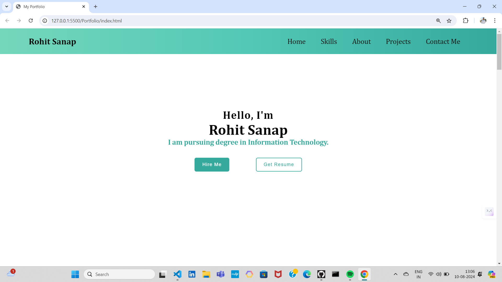

# CODSOFT Web Development Internship Projects 
Welcome to the repository showcasing the projects I completed during my web development internship at CodSoft. Over the course of this internship, I honed my skills in HTML, CSS, and JavaScript by working on various practical tasks. Each project reflects my growth and understanding of web development fundamentals, as well as my commitment to producing clean, efficient code.

## Projects Included :

### 1. Landing Page
This project is a modern landing page designed to engage users and provide essential information at a glance. It features a streamlined layout, engaging visuals, and clear calls to action, making it an ideal template for marketing or product-related websites.

### 2. Personal Portfolio
A responsive and visually appealing portfolio that highlights my skills, projects, and professional journey. This project focuses on clean design principles and an intuitive user experience, providing a comprehensive overview of my work and achievements.
-

### 3. Calculator
A functional calculator created using HTML, CSS, and JavaScript. This project showcases my ability to implement JavaScript logic to handle user input and perform basic arithmetic operations. The calculator is fully responsive and styled with CSS to enhance user interaction.
-

## Technologies Used :
HTML: For structuring content and providing the framework for each project.
CSS: For styling the projects, ensuring they are visually appealing and responsive.
JavaScript: For adding interactivity and functionality, particularly in the calculator project.

About This Repository
This repository serves as a testament to my learning and progress in web development during my time at CodSoft. Each project was an opportunity to apply theoretical knowledge in a practical setting, reinforcing my understanding of web development principles and practices.

## License

This project is licensed under the [MIT License](LICENSE), which means you're free to use, modify, and distribute the code as long as you include the original copyright and disclaimers. Refer to the LICENSE file for more details.

## Projects

**Landing Page**
- [Task 1](https://github.com/Rutujamurkut98/CodSoft-Web-Development-/tree/main/Calculatorg%20Page)

**Portfolio**
- [Task 2](https://github.com/Rutujamurkut98/CodSoft-Web-Development-/tree/main/Landing%20Page)

**Calculator**
- [Task 3](https://github.com/Rutujamurkut98/CodSoft-Web-Development-/tree/main/Portfolio)

---

